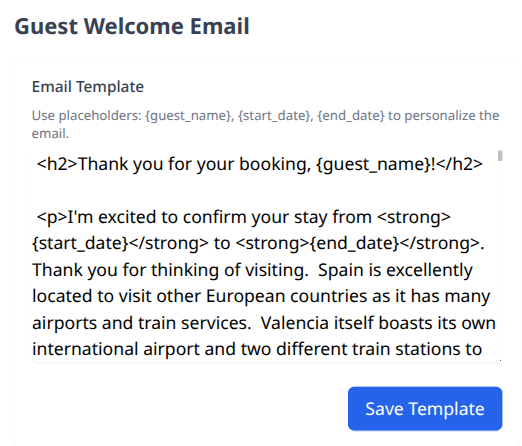

# Homestay


Homestay is a self-hostable, customizable booking app for you or your friend's
properties. It's designed to be simple host, modify, or extend to your specific
needs. 


# Features
* Interactive Calendar Interface - Visual booking calendar using FullCalendar with month/week views for easy
  date selection and booking management
* Guest Booking System - Simple booking form allowing guests to reserve dates with automatic overlap prevention
  and email confirmations
* Admin Dashboard - Comprehensive administrative interface for managing all bookings, blocked dates, and system
  settings
* Date Blocking Functionality - Admin ability to block specific date ranges (maintenance, owner unavailable,
  etc.) that appear as "booked" to guests
* Dual User Authentication - Separate login systems for regular users (guest access code) and administrators
  with role-based permissions
* Email Notifications - Automated welcome emails to guests and booking notifications to owners with customizable
   templates
* Rate Limiting & Security - Built-in protection against spam and abuse with IP-based rate limiting
* Responsive Design - Mobile-friendly interface using Tailwind CSS that works across all devices
* Data Management - Complete CRUD operations for bookings and blocked dates with simple SQLite database storage for easy backup and restore operations
* Docker Deployment - Containerized application with Docker support for easy deployment and scaling



# Building
```bash
docker compose build
docker up -d
```
Starts a server at localhost:8080 by default.

# Responsible LLM Use Disclosure
This repository contains content generated or assisted by Large Language Models
(LLMs). While LLMs can be powerful tools for augmenting human capabilities, they
are not a replacement for critical thinking and intellectual rigor. The author
of this document has made efforts to ensure that any LLM-generated content is
accurately attributed and transparently disclosed. However, readers should be
aware the LLMs may introduce subtle biases, errors, or limitations that are not
immediately apparent.

To maintain the integrity and accountability of the work, the author commits to
the following principles:
* Training: efforts have been made to stay current with the latest developments
  and limitations of LLMs, and to use the judiciously and with careful
  consideration
* Transparency: we acknowledge the use of LLMs in this codebase and disclose any
  generated content
* Traceability: we make available, upon request, the prompts and inputs used to
  generate any LLM-assisted content

Readers are encouraged to critically evaluate the content of this document,
considering the potential risks and limitations associated with LLM-generated
material. 

For more information, see https://colinmilhaupt.com/posts/responsible-llm-use/
